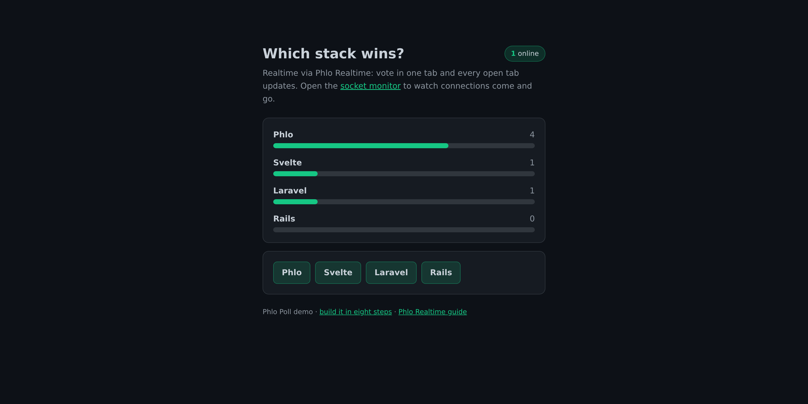

# phlo-demo-poll

A realtime poll built with [Phlo](https://phlo.tech) - the finished app from the
eight-step [Phlo Poll tutorial](https://phlo.tech/learn). One route serves both a
plain browser (POST, redirect, GET) and the Phlo frontend (async `apply()`), and
every vote pushes live to all open tabs over Phlo Realtime, with no hand-written
JavaScript. It uses the JSON file driver (`%JSONDB`), so there is no database to
set up.



## Run

```bash
git clone https://github.com/q-ainl/phlo-demo-poll.git
cd phlo-demo-poll
docker compose up   # http://localhost
```

`docker compose up` gives live realtime out of the box: the `phlo-daemon` image
runs FrankenPHP and the Phlo Realtime daemon together, so votes push to every open
tab. Swap the image for `ghcr.io/q-ainl/phlo` to run the poll as a plain async
poll (`cast()` is guarded, so it never breaks without a daemon).

## Realtime

Live cross-tab updates and the `/monitor` presence view use **Phlo Realtime**,
which runs in the [Phlo Daemon](https://github.com/q-ainl/phlo-daemon) (a websocket + worker process on port 3001). The
app sets a `token` cookie, the browser opens `wss://<host>/websocket` (proxied to
the daemon), and server-side `cast()` POSTs to the daemon so it broadcasts the new
`#results` to every connected tab. Run the daemon pointed at `www/app.php` and
proxy `/websocket` to it.

## What it shows
- One route, two transports (plain browser + async `apply()`).
- Phlo Realtime: `cast()` pushes the new `#results` and the online count to every tab.
- Presence + a live socket monitor at `/monitor`.

## License
MIT.
